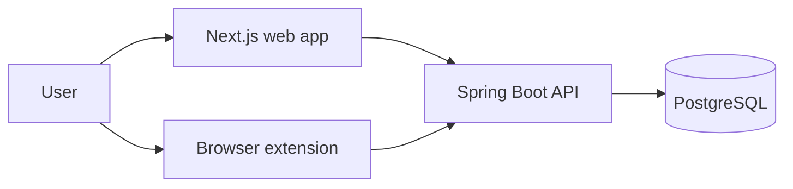

# Architecture

## System overview

## Components

### Web app (`web/`)

Responsibilities:

- signup and login
- session hydration via JWT + `GET /api/auth/me`
- dashboard filtering and manual CRUD
- home stats summary and recent activity
- application detail view with notes and status history

The web app is a thin API client. It does not own business logic that should be
authoritative across clients.

### API (`api/`)

Responsibilities:

- stateless JWT auth
- application CRUD
- status-history writes
- notes CRUD
- stats summary aggregation
- LinkedIn ingest endpoint for the extension

The API is the source of truth for validation, ownership, dedupe, and persisted
workflow history.

### Extension (`extension/`)

Responsibilities:

- detect LinkedIn job pages
- detect job postings on the four dedicated ATS platforms (Greenhouse,
  Lever, Workday, Ashby)
- detect job postings on other (non-LinkedIn, non-ATS) sites via a generic
  JSON-LD/heuristic fallback parser
- extract listing data from the current page
- prompt for manual confirmation or auto-capture on Apply-like clicks
  (LinkedIn only — every other source always requires manual confirmation)
- store extension auth in browser storage
- send captured listings to the API through the background worker

## Core flows

### Manual application flow

1. User logs in through the web app.
2. Web app stores the JWT in `localStorage`.
3. User creates or edits an application through the dashboard or detail view.
4. API persists the application and writes an initial or updated status event.

### LinkedIn capture flow

1. Content script detects a LinkedIn job listing.
2. Content script extracts title, company, URL, location, salary, and any available date signal.
3. Background worker reads the stored JWT from extension storage.
4. Background worker POSTs to `POST /api/integrations/linkedin`.
5. API canonicalizes the URL and dedupes on `(user_id, source_url)`.
6. If the record is new, the API creates it with `source=linkedin` and `currentStatus=applied`.
7. Background worker reports success or auth failure back to the page UI.

### Dedicated ATS capture flow

Phase 2 "source coverage": dedicated parsers for the four major hosted
ATS/job-board platforms, matched by hostname ahead of the generic fallback:

1. A content script (`content/ats-detector.ts`) runs only on
   `boards.greenhouse.io`/`job-boards.greenhouse.io`, `jobs.lever.co`,
   `*.myworkdayjobs.com`, and `jobs.ashbyhq.com`, and picks the matching
   extractor for the current hostname.
2. Each extractor emits the same canonical `ExtractedListing` shape as
   every other source. Greenhouse reads the page's own `__remixContext`
   loader data (richer than DOM scraping and specific to its current
   template); Lever and Ashby prefer schema.org `JobPosting` JSON-LD;
   Workday falls back to its documented `data-automation-id` attributes.
   Unsupported/missing fields are left `null` rather than guessed —
   nothing here ever blocks a capture over an unavailable field.
3. Like the generic flow below, this always shows the confirm banner (no
   Apply-click auto-capture) and shares the same detect/confirm/send
   runtime (`content/capture-runtime.ts`).
4. Background worker POSTs to `POST /api/integrations/capture` — same
   endpoint and `source=other` as the generic fallback; the ATS parsers
   don't get their own `source` value, since the goal is a single
   source-agnostic canonical record, not a per-platform badge.

### Generic capture flow

Last-resort fallback path for job postings on sites without a dedicated
parser (anything other than LinkedIn and the four ATS platforms above):

1. A content script runs on `<all_urls>` (excluding linkedin.com and the
   four ATS domains, which the dedicated flows above already cover) and
   cheaply checks whether the page looks like a job posting — a schema.org
   `JobPosting` JSON-LD block, or a job-shaped URL path plus a title
   signal. Everything else bails immediately with no further work.
2. If gated in, it extracts title/company/location/salary/logo, preferring
   JSON-LD over conservative meta-tag/DOM heuristics — no raw DOM-text
   scraping on a page we don't control.
3. This always shows the confirm banner — there's no Apply-click
   auto-capture for arbitrary sites.
4. Background worker POSTs to `POST /api/integrations/capture`, which
   behaves like the LinkedIn ingest endpoint but creates records as
   `source=other`.

### Status-tracking flow

1. Current status is stored on `job_applications`.
2. Every status write appends a row to `application_status_events`.
3. Stats and recent activity derive from that persisted history.

## Security baseline

- API auth is bearer-token based and stateless.
- The API permits unauthenticated access only to signup and login.
- The JWT principal is the user UUID; there is no server-side session.
- The web app stores the token in `localStorage`.
- The extension keeps auth in `chrome.storage.local` and uses the background
  worker for API writes.
- Content scripts should not hold bearer tokens.
- The extension holds `<all_urls>` host permission (and a matching
  `<all_urls>` content script, excluding linkedin.com) to support the
  generic capture fallback on arbitrary job sites. The generic content
  script's detection gate keeps it cheap/inert on non-job pages, and it
  never auto-submits — the user always confirms via the banner before
  anything is sent to the API.

## CORS model

The API allows:

- the configured web-app origin
- `chrome-extension://*`
- `moz-extension://*`

That is required because the extension background worker sends an `Origin`
header even though browser host permissions bypass the browser's usual CORS
enforcement.

## Persistence model

Primary tables:

- `users`
- `auth_identities`
- `job_applications`
- `application_status_events`
- `application_notes`

See [`DATA_MODEL.md`](DATA_MODEL.md) for column-level details.

## Current constraints

- OAuth providers are scaffolded in the schema but not implemented yet.
- LinkedIn has a dedicated parser with Apply-click auto-capture; Greenhouse,
  Lever, Workday, and Ashby each have a dedicated (JSON-LD/platform-data-
  first) parser but always require manual confirmation; every other site
  goes through the generic JSON-LD/heuristic fallback parser, which is more
  conservative (JSON-LD-first, no raw DOM-text scraping).
- LinkedIn selectors are expected to need ongoing tuning against the live
  site. All four ATS parsers (Greenhouse/Lever/Ashby via real fetched
  postings, Workday via a live browser pass against real tenants — see
  `extension/README.md` "ATS parser verification status") are confirmed
  working as of 2026-07-04.
- The current status taxonomy is intentionally compact to keep MVP analytics and
  filtering simple.
