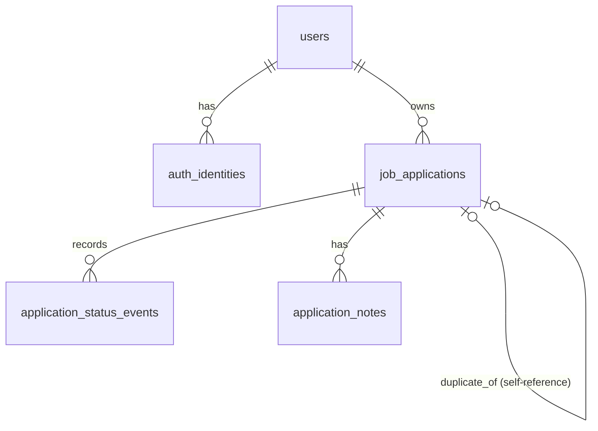

# Data Model

This document describes the current persisted model behind the Job Application
Tracker MVP.

## Tables

### `users`

Stores first-party user accounts.

| Column | Type | Notes |
| --- | --- | --- |
| `id` | `uuid` | Primary key |
| `email` | `varchar(255)` | Unique |
| `password_hash` | `varchar(255)` | Used for email/password auth |
| `display_name` | `varchar(255)` | Required |
| `avatar_url` | `varchar(2048)` | Nullable |
| `created_at` | `timestamptz` | Default `now()` |
| `updated_at` | `timestamptz` | Default `now()` |

### `auth_identities`

Reserved for future OAuth providers.

| Column | Type | Notes |
| --- | --- | --- |
| `id` | `uuid` | Primary key |
| `user_id` | `uuid` | FK to `users.id`, cascade delete |
| `provider` | `varchar(20)` | `github`, `google`, `apple`, or `email` |
| `provider_user_id` | `varchar(255)` | Provider-specific identifier |
| `created_at` | `timestamptz` | Default `now()` |

Constraints:

- unique on `(provider, provider_user_id)`

Current state:

- the table exists, but the MVP only writes email/password auth to `users`

### `job_applications`

Primary application record.

| Column | Type | Notes |
| --- | --- | --- |
| `id` | `uuid` | Primary key |
| `user_id` | `uuid` | FK to `users.id`, cascade delete |
| `source` | `varchar(20)` | `linkedin` or `manual` |
| `source_url` | `varchar(2048)` | Nullable, unique per user when present |
| `company_name` | `varchar(255)` | Required |
| `job_title` | `varchar(255)` | Required |
| `location_text` | `varchar(255)` | Nullable, raw/display source of truth |
| `salary_text` | `varchar(255)` | Nullable, raw/display source of truth |
| `applied_at` | `timestamptz` | Nullable; auto-filled at create/status-transition time (see below) |
| `posted_at` | `timestamptz` | Nullable; the listing's original posting date, distinct from `applied_at` |
| `location_city` | `varchar(120)` | Nullable, structured |
| `location_region` | `varchar(120)` | Nullable, structured (state/province) |
| `location_country` | `varchar(120)` | Nullable, structured |
| `is_remote` | `boolean` | Nullable (unknown vs. false) |
| `salary_min` | `numeric(12,2)` | Nullable, structured |
| `salary_max` | `numeric(12,2)` | Nullable, structured |
| `salary_currency` | `varchar(10)` | Nullable (e.g. `USD`) |
| `salary_period` | `varchar(20)` | Nullable: `yearly`, `monthly`, `weekly`, `hourly` |
| `company_logo_url` | `varchar(2048)` | Nullable |
| `duplicate_of_id` | `uuid` | Nullable, self-referencing FK (see below) |
| `current_status` | `varchar(20)` | One of the six canonical statuses |
| `created_at` | `timestamptz` | Default `now()` |
| `updated_at` | `timestamptz` | Default `now()` |

Constraints:

- unique on `(user_id, source_url)`
- `source` CHECK includes `linkedin`, `manual`, `other` (the generic capture source)
- `duplicate_of_id` references `job_applications.id`, `ON DELETE SET NULL`

Indexes:

- `(user_id)`
- `(user_id, current_status)`
- `(duplicate_of_id)`
- `(user_id, lower(company_name), lower(job_title))` — duplicate/repost lookups

Structured location/salary fields are derived server-side from the raw text
via best-effort parsers when a capture source doesn't already supply
structured data (see `common/util/LocationParser` and
`common/util/SalaryParser`); the raw text columns remain the display
fallback and source of truth.

`applied_at` auto-fill: left `null` when an application is created directly
into `saved` status; set to the capture/create time otherwise, and set on
first transition into `applied` if still unset. `posted_at` is unrelated —
it only reflects the original listing date when a capture source supplies
one.

`duplicate_of_id` points at the most recent existing application for the
same user with a case-insensitive/trimmed company+title match (see
`applications/DuplicateDetector`). It is informational only — it never
blocks or merges a create/update, per docs/AGENTS.md's guardrail against
silently mutating records on a weak signal.

### `application_status_events`

Append-only status history for each application.

| Column | Type | Notes |
| --- | --- | --- |
| `id` | `uuid` | Primary key |
| `application_id` | `uuid` | FK to `job_applications.id`, cascade delete |
| `status` | `varchar(20)` | Same enum as `job_applications.current_status` |
| `note` | `text` | Nullable |
| `changed_at` | `timestamptz` | Default `now()` |

Indexes:

- `(application_id)`
- `(changed_at desc)`

### `application_notes`

Freeform notes attached to an application.

| Column | Type | Notes |
| --- | --- | --- |
| `id` | `uuid` | Primary key |
| `application_id` | `uuid` | FK to `job_applications.id`, cascade delete |
| `content` | `text` | Required |
| `created_at` | `timestamptz` | Default `now()` |
| `updated_at` | `timestamptz` | Default `now()` |

Indexes:

- `(application_id)`

## Relationships

## Status model

The application lifecycle currently uses six values:

- `saved`
- `applied`
- `interviewing`
- `rejected`
- `ghosted`
- `offer`

`job_applications.current_status` stores the current snapshot. The full audit
trail lives in `application_status_events`.

## Near-term planned extensions

Phase 1 (capture foundation) is implemented: structured location/salary,
company logos, auto-filled `applied_at`, and duplicate/repost detection all
live on `job_applications` now. (A job-description snapshot field was tried
and then removed — see `V3__remove_description_snapshot.sql` — capturing it
reliably wasn't worth the complexity; `sourceUrl` links back to the original
listing instead.) The roadmap still points toward additional persisted
fields and tables for:

- reminder and notification events
- external email/integration identities
- resume/cover-letter associations

Those additions should extend the current model rather than bypass it.
